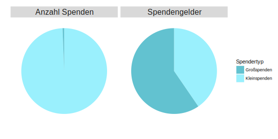

# Spenderliste Kurz
Da Sebastian Kurz seine Spenderliste transparent und für jeden einsehbar zur Verfügung stellt, ist es natürlich interessant, sich diese Daten genauer anzusehen. Es stellen sich zum Beispiel die Fragen, wie viele Kleinspenden es in Relation zur gesamten Spendenanzahl gibt und wieviel diese Kleinspenden an den gesamten Spendengeldern ausmachen.

## Datenbeschaffung
Die Spenderliste ist auf der Website von Sebastian Kurz frei zugänglich ([Link zur Spenderliste](https://www.sebastian-kurz.at/spendenuebersicht, "Spenderliste Sebastian Kurz")). Diese Liste ist in zwei Tabellen unterteilt:
* Kleinspenden (bis 3.500 €)
* ausweispflichtige Spenden (ab 3.501 €)

Diese zwei Tabellen können auf der Website durchgeblättert werden, wobei immer zehn Spender pro Seite angezeigt werden.

Für diese Analyse wurden mittels R-Scripts die Spendenhöhe und das Datum der Spenden auf jeder Seite ausgelesen und in einer csv-Datei zusammengeführt. Diese Daten werden zweimal heruntergeladen und verglichen, da sonst fehlende und doppelte Einträge entstehen könnten, wenn während des Downloads eine neue Spende auftauchen würde. Um die Privatsphäre zu schützen, wurde außerdem entschieden, die Namen der spendenden Personen nicht zu speichern.

## Auswertung
Die Auswertung der gespeicherten Daten erfolgt automatisch durch R-Scripts. Bei Ausführung von fullAnalysis.R werden die Daten heruntergeladen und analysiert. Die Ergebnisse werden im /output-Ordner abgelegt und umfassen
* zwei gegenübergestellte Tortendiagramme, die die Verhältnisse wiedergeben (plot.svg),
* eine Datei, in der die Daten, auf denen die Diagramme aufbauen, enthält enthalten sind (numbers.txt),
* eine Datei, in der die Quantile der gesamten Spendentabelle enthalten sind (quantiles.txt).

## Ergebnisse
Für die Daten, die am 30.09.2017 um 18:26 veröffentlicht waren, ergeben sich die Diagramme wie folgt:

Aus den Daten wurde erfasst, dass ca. 99,4 % der 8269 Spenden als Kleinspenden (bis 3.500 €) kategorisiert sind. Die ca. 0,6 % Großspenden machen etwa 59,6 % der gesamt 2.010.567 € an Spendengeldern aus. Aus der quantiles-Datei lässt sich entnehmen, dass 90 % der Spenden kleiner als 125 € sind, der Median bei 50 € und das Minimum bei 0 € liegt. Bei der Kontrolle der Daten auf der Website wurde festgestellt, dass tatsächlich zwei Personen 0 € gespendet haben. Dies deutet darauf hin, dass diese Personen weniger als einen Euro gespendet haben und die Werte auf der Website auf ganze Euro gerundet werden.

## Kommentar
Wichtig ist noch zu erwähnen, dass hier die Spenden und nicht die Spender analysiert wurden. Es kommt durchaus vor, dass Personen öfter oder gemeinsam spenden, jedoch können hier ohne Namen keine genaueren Aussagen gemacht werden. Auch mit Namen sind nur Schätzungen möglich, da etliche Personen auf der Website nicht genannt werden wollen.
